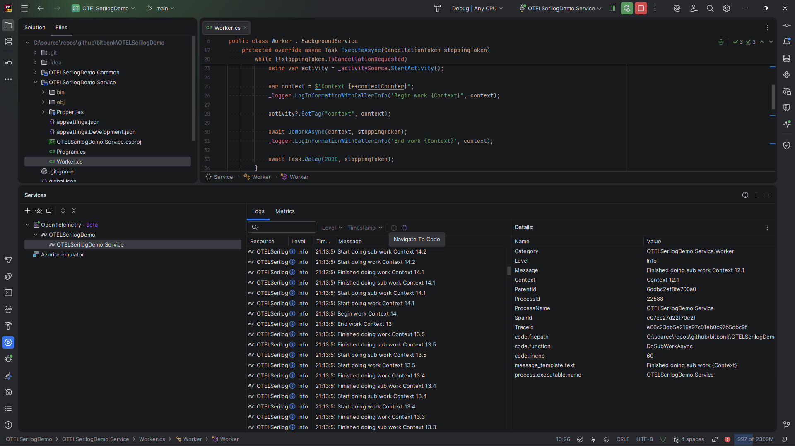

# Open Telemetry with Serilog Demo

This demonstrates how Open Telemetry is done with [Serilog](https://serilog.net/).

The logging application `OTELSerilogDemo.Service` does not have a direct reference to Serilog or any other library
except
`Microsoft.Extensions.*`, it uses `Microsoft.Extensions.Logging` for logging and `System.Diagnostics.ActivitySource` for
creating Open Telemetry traces and spans.

Serilog ist just used as the sink (Console and Open Telemetry exporter) which is all set up in an external helper
nuget package (`OTELSerilogDemo.Common`). This way we make sure that the code of our services (which are part of a
framework) do not take a direct dependency on all of these 3rd party packages.

When this demo is run in the latest JetBrains Rider 2025.2 EAP with
the [Open Telemetry plugin](https://plugins.jetbrains.com/plugin/27488-opentelemetry/),
the structured logs show up directly in Rider:

